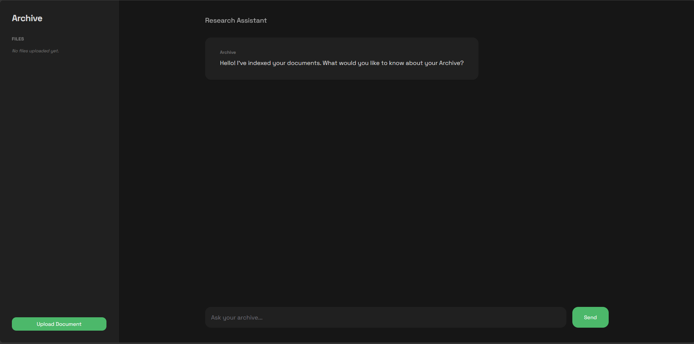

# YafRAG Workspace

YafRAG is a simplified, memory-optimized Retrieval-Augmented Generation (RAG) implementation. It enables querying and chatting with uploaded documents easily.



## Architecture

- **Frontend**: React, built with Vite and TailwindCSS v4, featuring a beautiful interface using [HeroUI v3](https://heroui.com/).
- **Backend**: Python (FastAPI), providing endpoints for document ingestion and real-time streaming LLM chats. Uses `MarkItDown` for deep document parsing underneath LanceDB.
- **Infrastructure**: Standardized with `docker-compose` for easy deployment and container constraints suited for small VPS environments.

## Local Setup

### Using Docker Compose

1. Clone the project.
2. Ensure you create a `.env` file at the root by copying `.env.example` and filling in your `GEMINI_API_KEY`:
   ```bash
   cp .env.example .env
   ```
3. Run the application:
   ```bash
   docker-compose up -d --build
   ```

The client will be available at `http://localhost:5173/` and the backend will start at `http://localhost:8080/`.

### Development Servers

If developing locally without Docker:

- For Backend: `cd server && pip install -r requirements.txt && uvicorn main:app --reload --port 8080`
- For Frontend: `cd client && npm install && npm run dev`

## Deployment

The project contains a GitHub Action Workflow in `.github/workflows/deploy.yml` which is configured for **manual deployment** (`workflow_dispatch`). It attempts to connect to your remote VPS via SSH, pull the latest code, and spin up `docker-compose up -d --build` automatically.

You will need to configure the following GitHub Repository Secrets:

- `HOST`: Server IP Address
- `USERNAME`: SSH Username
- `SSH_PRIVATE_KEY`: Your SSH Private Key
- `GEMINI_API_KEY`: API Key for the Gemini LLM
